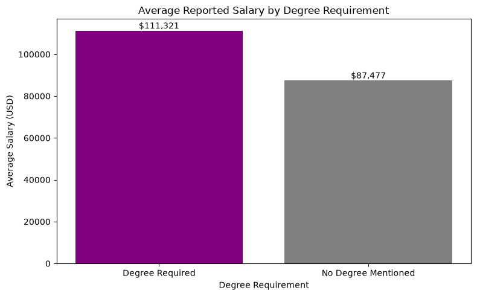
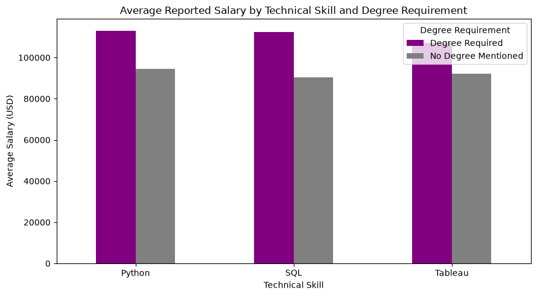

# 📊 Degree Impact on Data Analyst Salaries

### A Data Cleaning, SQL, and Analysis Project

This project analyzes data analyst job postings to compare salary patterns, job requirements, and skill expectations between roles that mention a degree requirement and roles that do not.

Using two cleaned datasets, the project explores how education requirements relate to reported salaries and examines whether data analyst opportunities are accessible through both traditional degree pathways and alternative skill-based pathways.

---

## 1. 🔧 Project Setup Instructions

### Clone the Repository

```bash
git clone https://github.com/Wyparks04/Degree_Impact_On_Data_Analyst_Salaries.git
cd Degree_Impact_On_Data_Analyst_Salaries
```

### Create and Activate a Virtual Environment

```bash
python -m venv venv
```

**macOS/Linux:**

```bash
source venv/bin/activate
```

**Windows:**

```bash
venv\Scripts\activate
```

### Install Dependencies

```bash
pip install -r requirements.txt
```

### Run the Project

```bash
jupyter notebook
```

---
## 2. 📘 Project Overview

The analysis compares data analyst job postings that mention a degree requirement with those that do not.

The project uses Python, Pandas, and SQLite to clean the datasets, perform descriptive analysis, build a relational database, and answer analytical questions about salary and job requirements.

The goal is to provide data-driven insight into the relationship between education requirements and reported compensation in the data analytics job market.

---

## 3. 📂 Execution Order

Run the notebooks in the following order to reproduce the full workflow:

1. **`01_degree_jobs_cleaning.ipynb`** – Cleaning and descriptive analysis of the degree-required dataset.
2. **`02_no_degree_jobs_cleaning.ipynb`** – Cleaning and descriptive analysis of the no-degree dataset.
3. **`03_data_analyst_jobs_database.ipynb`** – SQLite database creation, SQL analysis, and visualization of results.

---

## 4. 📁 Datasets

### AI Jobs Dataset — Degree-Required Roles

The **Global AI Job Market & Salary Trends 2025** dataset contains more than 15,000 AI-related job postings, including data analyst roles.

The dataset contains information about salaries, job requirements, company characteristics, geographic location, and other job attributes.

For this project, the data was cleaned and filtered to create a dataset of data analyst positions that mention a degree requirement.

### Data Analyst Jobs Dataset — No-Degree Roles

The second dataset is derived from Luke Barousse's **Data Jobs** dataset.

The original dataset was filtered to include only job postings with the title **"Data Analyst"**:

```python
df = pd.read_csv("data_jobs.csv")
df = df[df["job_title"] == "Data Analyst"].reset_index(drop=True)
df.to_csv("data_analyst_jobs.csv", index=False)
```

The resulting dataset was then cleaned and analyzed to identify data analyst postings that do not mention a degree requirement.

---

## 5. 📊 Descriptive Statistics

Descriptive statistics were calculated for the `salary_usd` column in each cleaned dataset.

### Degree-Required Dataset

| Metric | Value |
| --- | ---: |
| Count | 759 |
| Mean Salary (USD) | $111,321 |
| Standard Deviation | $57,746 |
| Minimum | $32,542 |
| 25th Percentile | $69,003 |
| Median | $96,074 |
| 75th Percentile | $136,232 |
| Maximum | $361,541 |

### No-Degree Dataset

| Metric | Value |
| --- | ---: |
| Count | 345 |
| Mean Salary (USD) | $87,477 |
| Standard Deviation | $40,811 |
| Minimum | $35,000 |
| 25th Percentile | $67,500 |
| Median | $85,000 |
| 75th Percentile | $102,500 |
| Maximum | $650,000 |

> **Note:** Salary statistics are calculated only from job postings with a reported `salary_usd` value. A large number of job postings in the no-degree dataset do not contain salary information, so these statistics should not be interpreted as representing every posting in the dataset.

---

## 6. 🗄️ SQL Analysis

Notebook 03 creates a SQLite database containing two tables:

- `degree_jobs`
- `no_degree_jobs`

Each table contains cleaned job-posting data, with `job_id` used as the primary key.

SQL queries are then used to compare degree-required and no-degree-mentioned Data Analyst positions and investigate differences in reported salaries and job characteristics.

### Key SQL Analysis

The project includes three primary SQL queries:

**Query 1 — Average Salary by Degree Requirement**

Compares the average reported salary between degree-required and no-degree-mentioned Data Analyst positions.

**Query 2 — Average Salary by Employment Type**

Compares average reported salaries between degree-required and no-degree-mentioned positions across employment types, including full-time, part-time, and contract roles where salary data is available.

**Query 3 — Average Salary by Technical Skill**

Compares average reported salaries for positions mentioning Python, SQL, and Tableau between the degree-required and no-degree-mentioned groups.

The SQL analysis provides a structured comparison of the two datasets and demonstrates the use of SQLite for relational data analysis.

---

## 7. 📈 Visualizations

The results of the SQL queries are visualized in Notebook 03.

The visualizations make it easier to compare salary outcomes and other characteristics between degree-required and no-degree data analyst roles.

The visualizations are generated directly from the SQL query results, connecting the database analysis to the final presentation of findings.

---

## 8. 🔍 Results and Findings

### 1. Salary Comparison

The descriptive analysis shows that the degree-required dataset has a higher average reported salary than the no-degree dataset.

However, the salary distributions overlap substantially, indicating that no-degree positions can also offer competitive compensation.

### Average Salary by Degree Requirement



### Average Reported Salary by Technical Skill and Degree Requirement



### 2. Salary Distribution

Both datasets contain substantial variation in reported salaries.

The difference between the mean and median salary in each dataset indicates that salary distributions are not perfectly symmetrical and that higher-paying postings influence the averages.

### 3. Data Quality

Salary information is incomplete in both datasets, particularly in the no-degree dataset.

Because salary information is available for only a subset of postings, salary comparisons should be interpreted as comparisons of **reported salaries**, rather than the actual compensation of every job posting.

### 4. Education Requirements

The project demonstrates that data analyst job postings exist both with and without explicit degree requirements.

This provides an opportunity to examine alternative pathways into data analytics based on technical skills, experience, and demonstrable project work.

---

## 9. ⭐ Key Takeaway

The analysis suggests that data analyst careers can be approached through multiple pathways.

Degree-required positions report higher average salaries in these datasets, but the salary ranges overlap with no-degree positions.

This suggests that formal education is one pathway into data analytics, while technical skills, experience, and demonstrable project work can provide alternative pathways.

A notable example is SQL. SQL is a commonly requested technical skill in data analyst job postings, and SQL can also be learned through alternative education and workforce-development programs.

This highlights the increasing accessibility of technical skills outside of traditional four-year degree programs.

---

## 10. 🧾 Conclusion

This project demonstrates how Python, Pandas, and SQLite can be combined to investigate questions about education requirements and compensation in the data analytics job market.

The degree-required dataset reports a higher average salary than the no-degree dataset. However, the substantial overlap in salary ranges shows that no-degree roles can also provide competitive compensation.

The results should be interpreted within the limitations of the datasets, particularly the incomplete salary reporting and differences in the source datasets.

Overall, the analysis illustrates that data analytics offers multiple potential pathways for individuals developing the technical skills required by employers.

---

## 11. ⚠️ Limitations

- **Incomplete salary reporting:** Many job postings do not include salary information, so salary comparisons are based only on postings with reported salaries.

- **Different data sources:** The degree-required and no-degree datasets come from different sources and may have different collection methods and characteristics.

- **Education requirement classification:** The project identifies degree requirements based on information contained in job postings. Employer descriptions may not always fully represent whether a degree is actually required.

---

## 12. 📚 Data Sources

### 1. Global AI Job Market & Salary Trends 2025

Sajjad, B. — Kaggle

[Global AI Job Market & Salary Trends 2025](https://www.kaggle.com/datasets/bismasajjad/global-ai-job-market-and-salary-trends-2025)

### 2. Data Jobs Dataset

Barousse, L. — Hugging Face

[Data Jobs Dataset](https://huggingface.co/datasets/lukebarousse/data_jobs)

---

## 🛠️ Tools and Technologies

- VS Code
- Python
- Pandas
- SQLite3
- Jupyter Notebook
- Git / GitHub
- Matplotlib

## AI Usage

I used **ChatGPT** and **Perplexity** to improve time efficiency during this project. They were used to help write and refine Markdown documentation in the notebooks and `README.md`, as well as to assist with writing and troubleshooting SQL queries.
